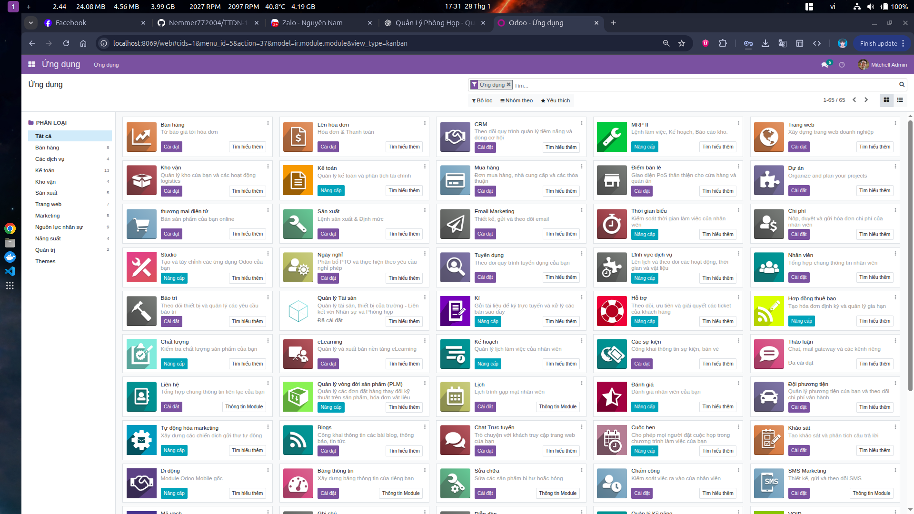
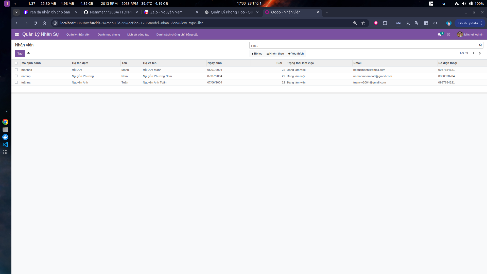
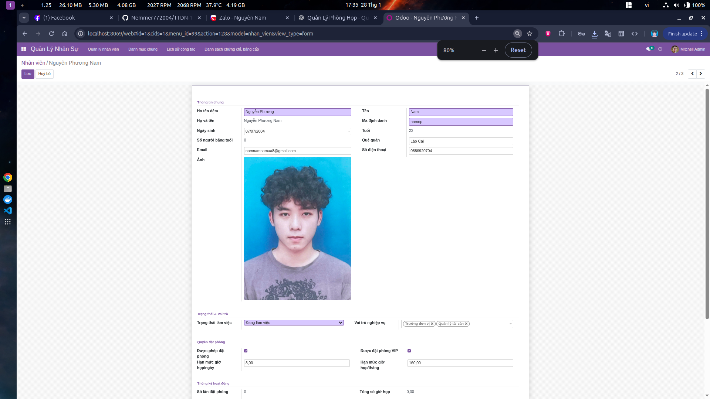
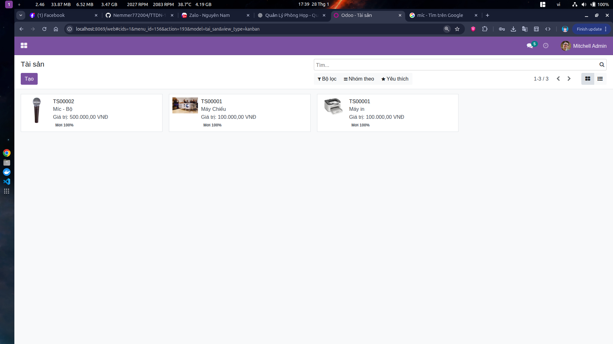
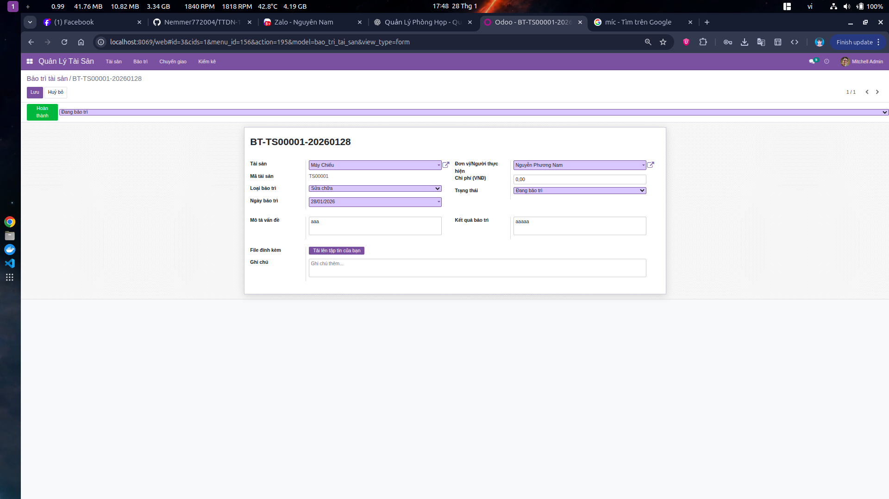
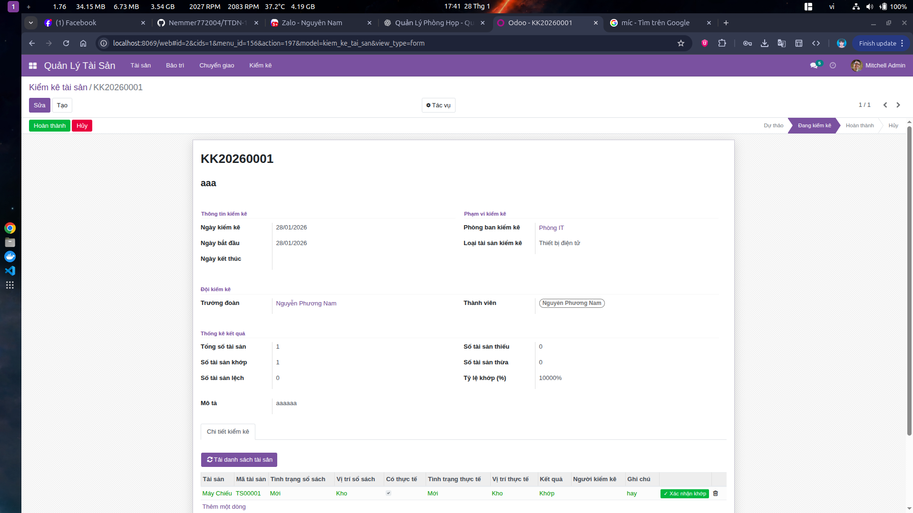
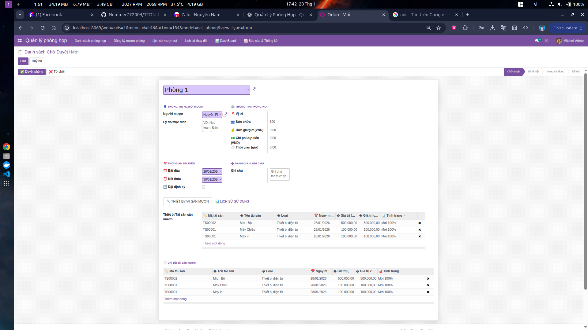
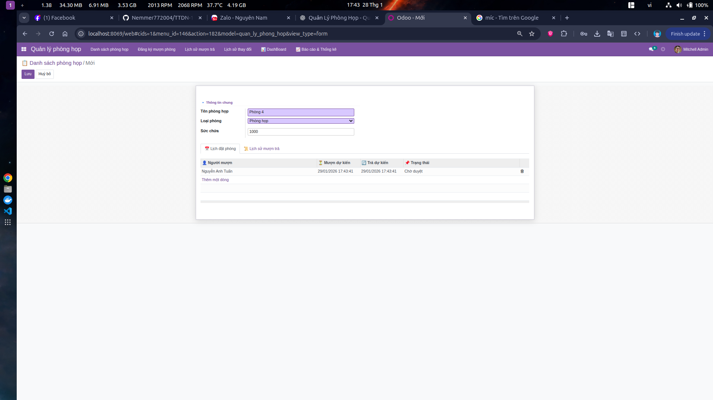
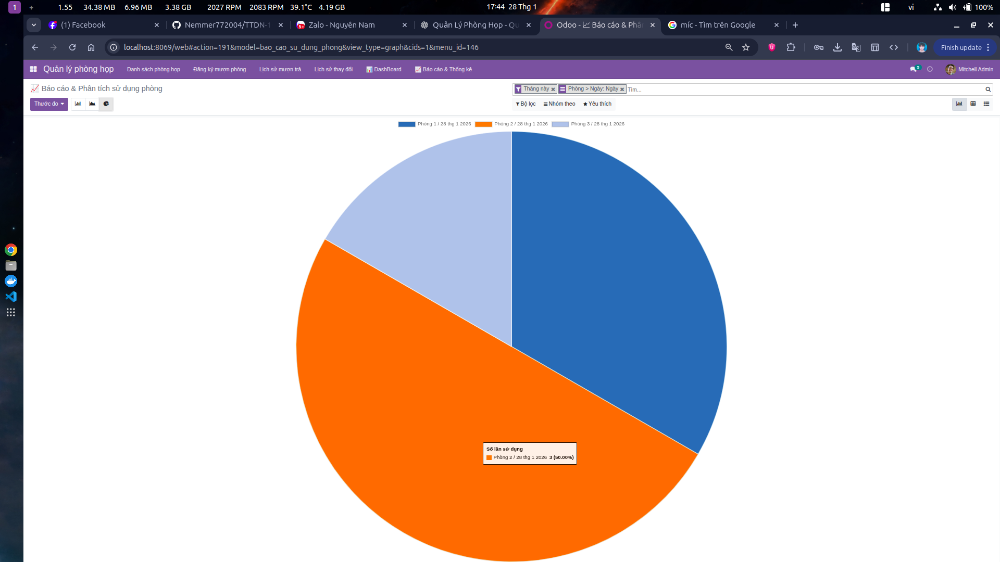

<h2 align="center">
    <a href="https://dainam.edu.vn/vi/khoa-cong-nghe-thong-tin">
    🎓 Faculty of Information Technology (DaiNam University)
    </a>
</h2>
<h2 align="center">
    Hệ thống Quản lý Doanh nghiệp - Odoo ERP
</h2>
<h3 align="center">
    Nhóm 4 - TTDN-16-05-N4
</h3>

<div align="center">
    <p align="center">
        
        
        
    </p>

[](https://www.facebook.com/DNUAIoTLab)
[](https://dainam.edu.vn/vi/khoa-cong-nghe-thong-tin)
[](https://dainam.edu.vn)

</div>
---

## 📖 1. Giới thiệu

Dự án **Hệ thống Quản lý Doanh nghiệp** được xây dựng trên nền tảng **Odoo ERP** nhằm tối ưu hóa và tự động hóa các quy trình quản lý trong doanh nghiệp. Hệ thống tập trung vào **3 module chính**:

### 🎯 Các Module Chính

#### 🧑‍💼 **Quản lý Nhân sự (HR Management)**
- Quản lý thông tin nhân viên (hồ sơ, bộ phận, chức vụ)
- Quản lý hợp đồng lao động và lương thưởng
- Chấm công và quản lý nghỉ phép
- Đánh giá hiệu suất và phát triển nhân viên
- Quản lý tuyển dụng và onboarding

#### 📦 **Quản lý Tài sản (Asset Management)**
- Theo dõi tài sản cố định của doanh nghiệp
- Quản lý khấu hao tài sản tự động
- Lập kế hoạch bảo trì định kỳ
- Theo dõi vòng đời và lịch sử sử dụng tài sản
- Báo cáo tình trạng và giá trị tài sản

#### 🏢 **Quản lý Phòng họp (Meeting Room Management)**
- Đặt phòng họp trực tuyến dễ dàng
- Quản lý lịch sử sử dụng phòng họp
- Theo dõi trang thiết bị trong phòng
- Tối ưu hóa không gian làm việc
- Thống kê hiệu suất sử dụng phòng họp

Thay vì quản lý thủ công bằng giấy tờ hay các tệp Excel rời rạc, hệ thống mang đến một giải pháp **tập trung, hiện đại và dễ sử dụng**, giúp doanh nghiệp nâng cao hiệu quả vận hành.

---

## 🔧 2. Các công nghệ được sử dụng

<div align="center">

### Hệ điều hành


### Công nghệ chính


### Frontend Technologies


### Version Control & CI/CD


### Development Tools


</div>

---

## 🚀 3. Hình ảnh các chức năng

### 🏠 Trang Đăng nhập
Giao diện đăng nhập vào hệ thống Odoo với tính năng xác thực người dùng an toàn.

<p align="center">
  
</p>

**Tính năng chính:**
- Xác thực tài khoản email/password
- Hỗ trợ đa ngôn ngữ (Tiếng Việt/English)
- Quên mật khẩu và khôi phục tài khoản
- Bảo mật 2FA (Two-Factor Authentication)

---

### 📊 Dashboard Tổng quan
Dashboard hiển thị tổng quan về hoạt động của hệ thống, thống kê nhanh các module quan trọng.

<p align="center">
  
</p>

**Các thông tin hiển thị:**
- Biểu đồ thống kê nhân sự theo phòng ban
- Tổng số tài sản và giá trị tài sản
- Lịch họp hôm nay và tuần này
- Thông báo và nhiệm vụ cần xử lý
- Báo cáo nhanh về attendance và time-off

---

### 👥 Module Quản lý Nhân sự (HR Management)

#### 📋 Danh sách Nhân viên
Giao diện quản lý danh sách nhân viên với đầy đủ thông tin cá nhân, chức vụ và bộ phận.

<p align="center">
  
</p>

**Chức năng:**
- Xem danh sách nhân viên dạng list/kanban/form
- Tìm kiếm và lọc theo phòng ban, chức vụ
- Thêm/Sửa/Xóa thông tin nhân viên
- Export dữ liệu ra Excel/CSV
- Import hàng loạt từ file

#### 📝 Thông tin Chi tiết Nhân viên
Hồ sơ chi tiết của từng nhân viên với đầy đủ thông tin cá nhân và công việc.

<p align="center">
  
</p>

**Thông tin bao gồm:**
- Thông tin cá nhân (Họ tên, Email, SĐT, Địa chỉ)
- Thông tin công việc (Chức vụ, Phòng ban, Manager)
- Hợp đồng lao động và lương
- Lịch sử nghỉ phép và chấm công
- Tài liệu đính kèm (CV, bằng cấp, chứng chỉ)

#### ⏰ Quản lý Chấm công
Hệ thống chấm công check-in/check-out tự động với báo cáo chi tiết.

<p align="center">
  
</p>

**Tính năng:**
- Check-in/Check-out với timestamp
- Theo dõi giờ làm việc thực tế
- Báo cáo chấm công theo ngày/tuần/tháng
- Cảnh báo đi muộn, về sớm
- Tích hợp với hệ thống máy chấm công

#### 🏖️ Quản lý Nghỉ phép (Time Off)
Quản lý đơn xin nghỉ, phê duyệt và theo dõi số ngày phép còn lại.

<p align="center">
  
</p>

**Chức năng:**
- Tạo đơn xin nghỉ phép
- Quy trình phê duyệt đa cấp
- Theo dõi số ngày phép còn lại
- Lịch sử nghỉ phép
- Thông báo tự động khi có đơn mới

#### 📑 Hợp đồng Lao động
Quản lý hợp đồng lao động và thông tin lương của nhân viên.

<p align="center">
  
</p>

**Quản lý:**
- Các loại hợp đồng (Thử việc, Có thời hạn, Vô thời hạn)
- Thông tin lương cơ bản và phụ cấp
- Ngày bắt đầu và kết thúc hợp đồng
- Gia hạn và thanh lý hợp đồng
- Lịch sử hợp đồng của nhân viên

---

### 🏗️ Module Quản lý Tài sản (Asset Management)

#### 📦 Danh sách Tài sản
Quản lý danh sách tài sản cố định của công ty với thông tin chi tiết.

<p align="center">
  
</p>

**Thông tin tài sản:**
- Mã tài sản và tên tài sản
- Loại tài sản (Máy móc, Thiết bị, Xe cộ, Nhà cửa...)
- Giá trị ban đầu và giá trị còn lại
- Ngày mua và hạn sử dụng
- Trạng thái (Đang sử dụng, Bảo trì, Thanh lý)
- Người quản lý và phòng ban sử dụng

#### 💰 Quản lý Khấu hao
Tự động tính toán và quản lý khấu hao tài sản theo các phương pháp khác nhau.

<p align="center">
  
</p>

**Tính năng:**
- Phương pháp khấu hao đường thẳng
- Phương pháp khấu hao giảm dần
- Tự động tạo bút toán khấu hao hàng tháng
- Báo cáo giá trị tài sản qua thời gian
- Lịch sử khấu hao chi tiết

#### 🔧 Quản lý Bảo trì
Lập kế hoạch và theo dõi các hoạt động bảo trì, sửa chữa tài sản.

<p align="center">
  
</p>

**Quản lý:**
- Tạo yêu cầu bảo trì
- Lịch bảo trì định kỳ
- Gán người phụ trách
- Theo dõi chi phí bảo trì
- Lịch sử bảo trì và sửa chữa

#### 📊 Báo cáo Tài sản
Báo cáo tổng hợp về giá trị và tình trạng tài sản.

<p align="center">
  
</p>

**Các báo cáo:**
- Báo cáo giá trị tài sản theo phòng ban
- Báo cáo khấu hao theo kỳ
- Báo cáo tình trạng bảo trì
- Báo cáo chi phí duy trì tài sản
- Dự báo thanh lý và thay thế

---

### 📅 Module Quản lý Phòng họp (Meeting Room Management)

#### 🏢 Danh sách Phòng họp
Quản lý thông tin các phòng họp và trang thiết bị.

<p align="center">
  
</p>

**Thông tin phòng:**
- Tên và mã phòng họp
- Sức chứa (số người)
- Trang thiết bị (Projector, TV, Whiteboard, Audio...)
- Vị trí (Tầng, Khu vực)
- Trạng thái (Sẵn sàng, Đang sử dụng, Bảo trì)

#### 📆 Đặt phòng họp
Giao diện đặt phòng họp trực tuyến với calendar view.

<p align="center">
  
</p>

**Tính năng:**
- Xem lịch phòng trống/bận theo ngày/tuần/tháng
- Đặt phòng nhanh chóng
- Chọn thời gian bắt đầu và kết thúc
- Mời người tham gia
- Ghi chú mục đích họp
- Thông báo tự động đến người liên quan

#### 📋 Lịch họp của tôi
Xem danh sách các cuộc họp sắp tới và lịch sử.

<p align="center">
  
</p>

**Quản lý:**
- Danh sách cuộc họp sắp tới
- Lịch sử cuộc họp đã tham gia
- Hủy hoặc thay đổi lịch họp
- Xác nhận tham dự
- Ghi chú và biên bản họp

#### 📊 Thống kê Phòng họp
Báo cáo sử dụng phòng họp và hiệu suất.

<p align="center">
  
</p>

**Báo cáo:**
- Tỷ lệ sử dụng phòng theo thời gian
- Phòng được sử dụng nhiều nhất
- Thời gian peak hours
- Số lượng cuộc họp theo phòng ban
- Đề xuất tối ưu hóa không gian

---

### ⚙️ Quản lý Hệ thống

#### 👤 Quản lý Người dùng
Quản lý tài khoản và phân quyền người dùng trong hệ thống.

<p align="center">
  
</p>

**Chức năng:**
- Tạo/Sửa/Xóa tài khoản người dùng
- Phân quyền theo nhóm (HR Manager, Asset Manager, Employee...)
- Thiết lập quyền truy cập module
- Quản lý phiên đăng nhập
- Lịch sử hoạt động của người dùng

#### 🔔 Thông báo
Hệ thống thông báo và nhắc nhở tự động.

<p align="center">
  
</p>

**Các loại thông báo:**
- Thông báo phê duyệt nghỉ phép
- Nhắc lịch họp sắp diễn ra
- Cảnh báo tài sản cần bảo trì
- Thông báo hợp đồng sắp hết hạn
- Tin nhắn nội bộ và chat

---


## ⚙️ 4. Cài đặt

### 4.1. Clone project

```bash
git clone https://github.com/Nemmer772004/TTDN-16-05-N4.git
cd TTDN-16-05-N4
git checkout nhom4
```

### 4.2. Cài đặt các thư viện và công cụ cần thiết

#### Cài đặt các gói phụ thuộc hệ thống:

```bash
sudo apt-get update
sudo apt-get install libxml2-dev libxslt-dev libldap2-dev libsasl2-dev \
    libssl-dev python3.10-distutils python3.10-dev build-essential \
    libssl-dev libffi-dev zlib1g-dev python3.10-venv libpq-dev
```

#### Cài đặt Docker (nếu chưa có):

```bash
# Ubuntu/Debian
sudo apt-get install docker.io docker-compose

# Hoặc tham khảo: https://docs.docker.com/engine/install/
```

### 4.3. Khởi tạo môi trường ảo Python

```bash
# Tạo môi trường ảo
python3.10 -m venv ./venv

# Kích hoạt môi trường ảo
source venv/bin/activate

# Cài đặt các thư viện Python từ requirements.txt
pip3 install -r requirements.txt
```

---

## 🗄️ 5. Setup Database

### 5.1. Khởi tạo PostgreSQL Database với Docker

Khởi chạy PostgreSQL database bằng Docker Compose:

```bash
docker-compose up -d
```

File `docker-compose.yml` đã được cấu hình sẵn với:
- **Database**: PostgreSQL
- **User**: odoo
- **Password**: odoo
- **Port**: 5435

### 5.2. Kiểm tra Database đang chạy

```bash
docker ps
```

Bạn sẽ thấy container PostgreSQL đang chạy.

---

## 🔧 6. Cấu hình hệ thống

### 6.1. Tạo file cấu hình odoo.conf

Tạo file **odoo.conf** từ template hoặc tạo mới với nội dung:

```ini
[options]
addons_path = addons
db_host = localhost
db_password = odoo
db_user = odoo
db_port = 5435
xmlrpc_port = 8069
admin_passwd = admin123
```

**Lưu ý**: Bạn có thể sao chép từ file `odoo.conf.template`:

```bash
cp odoo.conf.template odoo.conf
```

### 6.2. Tùy chỉnh cấu hình (tùy chọn)

Các tham số có thể tùy chỉnh trong `odoo.conf`:
- `xmlrpc_port`: Cổng web server (mặc định: 8069)
- `db_host`: Host của database
- `db_port`: Cổng của PostgreSQL
- `addons_path`: Đường dẫn đến các module addons
- `admin_passwd`: Mật khẩu master để quản lý database

---

## 🚀 7. Chạy hệ thống

### 7.1. Khởi động Odoo

```bash
# Đảm bảo môi trường ảo đã được kích hoạt
source venv/bin/activate

# Chạy Odoo với cấu hình
python3 odoo-bin.py -c odoo.conf -u all
```

### 7.2. Truy cập hệ thống

Mở trình duyệt và truy cập:

👉 **http://localhost:8069/**

### 7.3. Tạo Database lần đầu

1. Truy cập **http://localhost:8069/web/database/manager**
2. Chọn **"Create Database"**
3. Điền thông tin:
   - **Master Password**: `admin123` (từ odoo.conf)
   - **Database Name**: `odoo_nhom4`
   - **Email**: email của bạn
   - **Password**: mật khẩu cho admin
   - **Language**: Vietnamese / Tiếng Việt
   - **Country**: Vietnam
4. Chọn **"Create database"**

---

## 🎯 8. Cài đặt và cấu hình các Module

### 8.1. Đăng nhập vào hệ thống

- Sử dụng email và password đã tạo ở bước 7.3
- Đăng nhập vào hệ thống

### 8.2. Cài đặt các Module chính

Truy cập **Apps** và cài đặt các module sau:

#### 🧑‍💼 Module Quản lý Nhân sự:
- `hr` - Human Resources
- `hr_attendance` - Attendance Management
- `hr_holidays` - Time Off Management
- `hr_contract` - Employee Contracts
- `hr_recruitment` - Recruitment Process
- `hr_timesheet` - Timesheets

#### 📦 Module Quản lý Tài sản:
- `account_asset` - Assets Management
- `maintenance` - Maintenance Management
- `stock` - Inventory Management (tùy chọn)

#### 🏢 Module Quản lý Phòng họp:
- `calendar` - Calendar
- `resource_booking` - Resource Booking (custom module nếu có)

### 8.3. Cấu hình ban đầu

1. **Cấu hình công ty**:
   - Settings → General Settings → Company Information
   - Điền thông tin công ty

2. **Cấu hình nhân viên**:
   - HR → Configuration → Settings
   - Bật các tính năng cần thiết

3. **Cấu hình tài sản**:
   - Accounting → Configuration → Settings
   - Bật tính năng Assets Management

4. **Cấu hình phòng họp**:
   - Tạo các phòng họp trong Calendar hoặc module tùy chỉnh

---

## 👥 9. Phân quyền và quản lý người dùng

### 9.1. Tạo người dùng mới

1. Truy cập **Settings → Users & Companies → Users**
2. Chọn **"Create"**
3. Điền thông tin và phân quyền phù hợp:
   - **HR Manager**: Quản lý toàn bộ module HR
   - **Asset Manager**: Quản lý tài sản
   - **Employee**: Nhân viên thông thường

### 9.2. Các nhóm quyền chính

- **HR / Manager**: Quản lý nhân sự
- **HR / Officer**: Cán bộ nhân sự
- **Accounting / Manager**: Quản lý kế toán (cho tài sản)
- **User types**: Internal User, Portal User

---

## 📝 10. Hướng dẫn sử dụng

### 10.1. Module Quản lý Nhân sự

**Thêm nhân viên mới:**
1. HR → Employees → Create
2. Điền thông tin: Họ tên, Email, Bộ phận, Chức vụ
3. Gán hợp đồng và lương thưởng

**Quản lý nghỉ phép:**
1. HR → Time Off → Requests
2. Nhân viên có thể tạo đơn xin nghỉ
3. Manager phê duyệt

**Chấm công:**
1. HR → Attendances
2. Check-in / Check-out
3. Xem báo cáo chấm công

### 10.2. Module Quản lý Tài sản

**Thêm tài sản:**
1. Accounting → Assets → Create
2. Điền thông tin: Tên, Giá trị, Ngày mua
3. Thiết lập phương thức khấu hao

**Quản lý bảo trì:**
1. Maintenance → Maintenance → Requests
2. Tạo yêu cầu bảo trì
3. Gán người phụ trách
4. Theo dõi tiến độ

### 10.3. Module Quản lý Phòng họp

**Đặt phòng họp:**
1. Calendar → Create Meeting
2. Chọn phòng họp
3. Đặt thời gian và mời người tham gia
4. Lưu lịch họp

**Xem lịch phòng:**
1. Calendar → View
2. Chọn resource (phòng họp)
3. Xem lịch trống/bận

---

## 🐛 11. Xử lý sự cố thường gặp

### Lỗi kết nối Database
```bash
# Kiểm tra PostgreSQL đang chạy
docker ps

# Restart container nếu cần
docker-compose restart
```

### Lỗi module không tìm thấy
```bash
# Cập nhật danh sách module
python3 odoo-bin.py -c odoo.conf -u all --stop-after-init
```

### Port 8069 đã được sử dụng
```bash
# Kiểm tra process đang dùng port
lsof -i :8069

# Hoặc thay đổi port trong odoo.conf
xmlrpc_port = 8070
```

---

## 📚 12. Tài liệu tham khảo

- [Odoo Official Documentation](https://www.odoo.com/documentation/16.0/)
- [Odoo HR Module Guide](https://www.odoo.com/app/employees)
- [Odoo Asset Management](https://www.odoo.com/app/accounting)
- [Python 3.10 Documentation](https://docs.python.org/3.10/)
- [PostgreSQL Documentation](https://www.postgresql.org/docs/)
- [Docker Documentation](https://docs.docker.com/)

---

## 👨‍💻 13. Thông tin nhóm

**Nhóm 4 - TTDN-16-05-N4**

**Giảng viên hướng dẫn:** [Tên giảng viên]

**Thành viên:**
- Thành viên 1 - [Vai trò]
- Thành viên 2 - [Vai trò]
- Thành viên 3 - [Vai trò]
- Thành viên 4 - [Vai trò]

**Trường:** Đại học Đại Nam  
**Khoa:** Công nghệ Thông tin  
**Năm học:** 2025-2026

---

## 📄 14. License

Dự án này được phát triển cho mục đích học tập tại Đại học Đại Nam.

---

## 🙏 15. Lời cảm ơn

Xin cảm ơn:
- Thầy/Cô giảng viên đã hướng dẫn
- Khoa Công nghệ Thông tin - Đại học Đại Nam
- AIoTLab - Phòng thí nghiệm AI & IoT
- Cộng đồng Odoo Vietnam

---

<div align="center">

**Made with ❤️ by Nhóm 4 - Faculty of Information Technology - DaiNam University**

[](https://www.facebook.com/DNUAIoTLab)
[](https://github.com/Nemmer772004/TTDN-16-05-N4)

</div>
